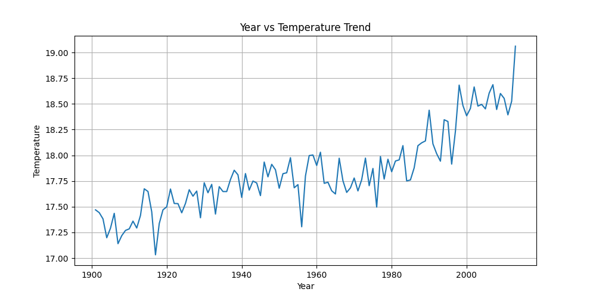
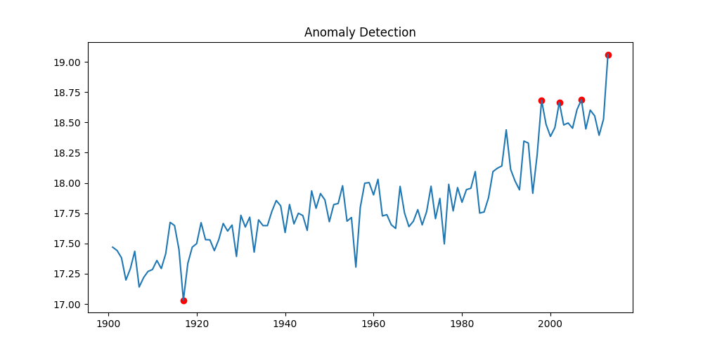
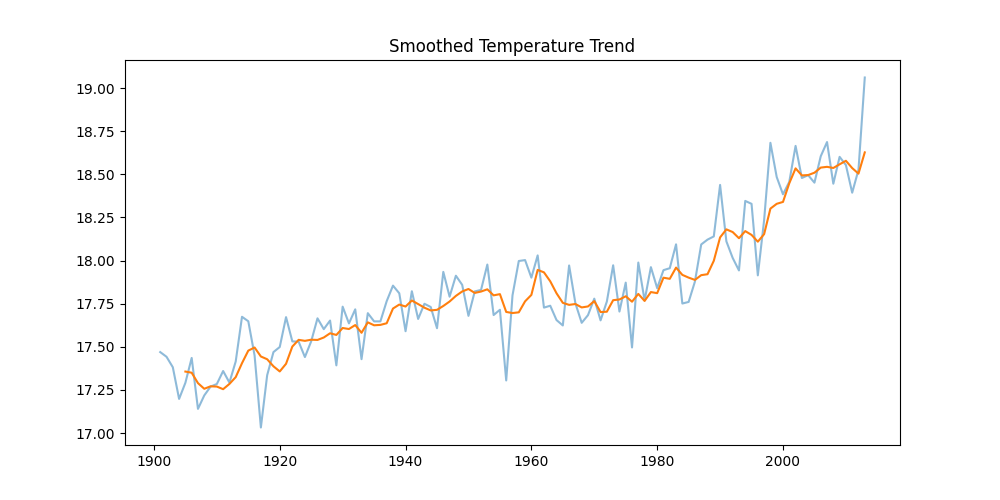
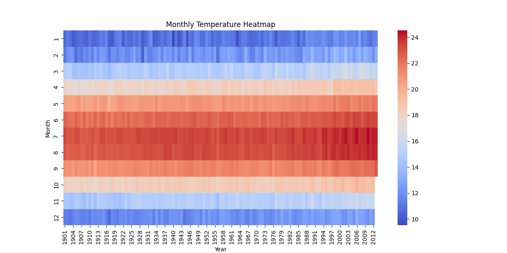
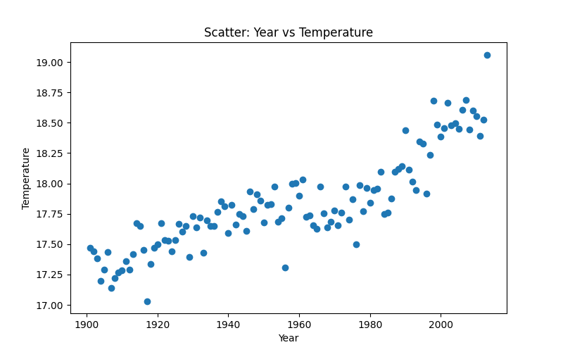

# 🌍 Climate Trend Analyzer

## 📌 Overview

This project analyzes historical climate data to identify temperature trends, seasonal patterns, anomalies, and future forecasts using time-series analysis.

## 🎯 Objective

To understand climate change patterns using data-driven insights.

## ⚙️ Tech Stack

* Python
* Pandas
* Matplotlib
* Seaborn
* Statsmodels

## 📊 Key Analysis

### 📈 Year vs Temperature Trend

### 🔍 Anomaly Detection

### 📉 Rolling Average Trend

### 🔮 Forecast

### 🌡 Heatmap (Seasonal Pattern)

### 📊 Scatter Plot

## 🧠 Insights

* Observed increasing temperature trends over time
* Identified abnormal climate variations
* Seasonal patterns clearly visible using heatmap
* Forecast indicates continued warming trend

## ▶️ How to Run

1. Open notebook
2. Run all cells

## 🚀 Future Work

* CO₂ vs Temperature analysis
* Dashboard integration
* Real-time data

The dataset used in this project is publicly available:

🔗 https://www.kaggle.com/datasets/berkeleyearth/climate-change-earth-surface-temperature-data

Download the file:
GlobalLandTemperaturesByCity.csv

## 👤 Author

Jatin Gujarathi
